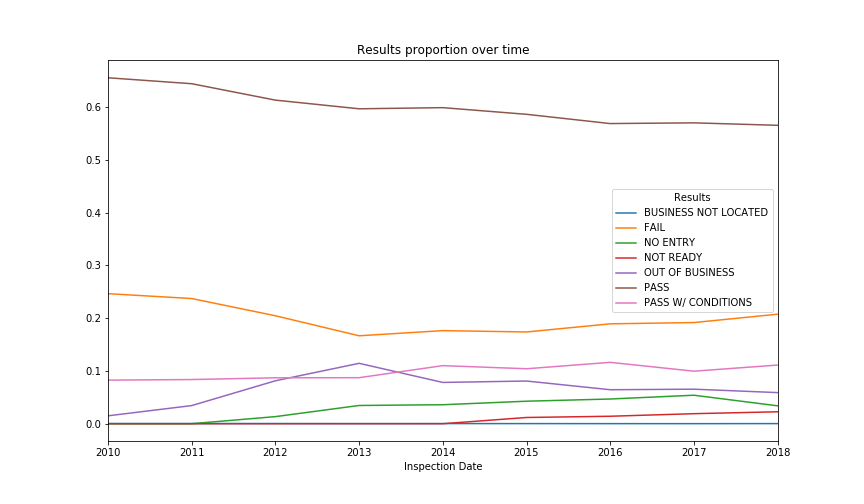

<!--more-->

<!---->

# The setting

**Chicago** is the third most populous and the second most visited city in the United States. It is an international hub for finance, culture, commerce, industry, education, technology, telecommunications and transportation. The Chicago area [has one of the highest gross domestic product (GDP) in the world](https://www.bea.gov/system/files/2018-09/gdp_metro0918_0.pdf) and the [most balanced economy in the U.S.](http://www.worldbusinesschicago.com/economy), due to its high level of diversification. Moreover, the *Windy City* ranks first globally in the [2018 Time Out City Life Index](https://www.timeout.com/chicago/news/chicago-named-the-worlds-best-city-for-having-it-all-012918), a quality of life survey, and seventh for the highest number of [ultra-high-net-worth residents](https://www.chicagobusiness.com/finance-banking/these-are-cities-most-ultra-rich-people): roughly 3,300 residents are worth more than $30 million. Nevertheless, Chicago is also a city of contradictions and inequalities: according to the 2008-2012 U.S. Census Bureau's American Community Survey, about 18.3% of families and 22.1% of the population lived below the poverty line.

# Inspections and food establishments

Chicago is home to 16,000 food establishments like restaurants, grocery stores, bakeries, wholesalers, lunchrooms, mobile food vendors and more. The city has many upscale dining establishments as well as many ethnic restaurant districts, including the Mexican American neighbourhoods, such as Pilsen along 18th Street, and La Villita along 26th Street; the Puerto Rican enclave of Paseo Boricua in the Humboldt Park neighbourhood; Greektown, along South Halsted Street, immediately west of downtown; Little Italy, along Taylor Street; Chinatown in Armour Square; Polish Patches in West Town; Little Seoul in Albany Park around Lawrence Avenue; Little Vietnam near Broadway in Uptown; and the Desi area, along Devon Avenue in West Ridge.

To ensure the compliance with the [Chicago Food Code](https://www.chicago.gov/content/dam/city/depts/cdph/food_env/general/Food_Protection/FoodCodeRules_Effective_Feb12019.pdf), the **Chicago Department of Public Health (CDPH)** conducts routine, unannounced food inspections, also called *canvass inspections*. The goals of these inspections are:
- to ensure the immediate safety of restaurant customers and employees;
- to prevent foodborne illness outbreaks;
- to help the public learn which restaurants adhere to public health regulations.

CDPH inspects most food establishments twice a year, with other establishments deemed as lower risk inspected once a year or once every other year. In addition to routine canvass inspections, CDPH also conducts license inspections for newly-opened businesses, complaint inspections in response to submitted concerns or suspected food poisoning, and re-inspections for issues arising from canvass inspections that require correction.

The inspections' results are available [online](http://webapps1.chicago.gov/healthinspection/inspection.jsp).

# The analysis

We analysed food inspections' results to give an overview of the city's food safety over the last decade. The aim was to identify patterns at the social and geographical levels, focusing our efforts in pinpointing **where to eat safely in Chicago**. With our work, we hope to raise awareness about the Chicago's food safety landscape and instruct people on the quality of the establishments they regularly visit.

In this article, we first take a look at the different facilities' predispositions to inspection failure. Then, we compare famous fast-food restaurant chains, highlighting very interesting findings, and we also present some curious facts about Food Code violations. Next, we address our main objective: showing which neighbourhoods are the safest food-wise and explore the evolution of the neighbourhoods' safety throughout time. Finally, at the end of the article, we assess the usefulness and the potential effects of the inspections.

We use the [Chicago Metropolitan Agency for Planning website](https://www.cmap.illinois.gov/data/community-snapshots) to interpret in a deeper way our results, as they provide community snapshots that summarize demographics, housing, employment, transportation habits, retail sales, property values, and land use in all 77 Chicago community areas, which correspond to the "neighbourhoods" we are considering.
<!-- We have built small tables with the different features we found interesting on the best and worse Community Areas according to the two main aspects we considered, namely the **RISK 1 (HIGH)** rate and the **PASS** rate. -->

## Facility types analysis

Food inspection concerns a very large variety of catering-related services. Let's see if and how the facility types and inspection results are tied to one another. As one would expect, the distribution of these facilities is extremely uneven: restaurants are by far the most represented type in Chicago counting 18,073 distinct establishments, which corresponds to 60% of the city's facilities. It is followed by grocery stores with 5,792 instances (20%) and by schools with a total of 1,125 facilities (4%). Let's now take a look at the **average fail rate per facility type**:

<figure class="highcharts-figure">
    

    
</figure>

It appears that three facility types in particular have a higher failure rate than the rest:
   - the liquor stores
   - the wholesale distributors
   - the taverns and bars

A way of interpreting this would be to notice that when the main sold item is alcohol, less care is taken in making the facilities clean and safe. As for wholesale distributors, their size and the fact that they are mostly used by companies rather than individuals could explain a lack of neatness. Moreover, for taverns it could be harder to keep it as clean as other establishments because of the behaviour of drunk clients.

On the other hand, it is reassuring to observe that the most frequent establishment type, restaurant, has an average fail rate among the lowest. Moreover, facilities taking care of children (daycares, schools...) and hospitals seem to make an extra effort for food safety and show rigorous food management as they tend to have a low probability of inspection failing.

Overall it is difficult to extract any really meaningful generalization but it seems that the fail rate follows a rather intuitive behaviour since the facilities that are the most critical for public health are well regulated and the ones that have more recreative purposes are not as strict regarding food safety. Actually, each establishment has an associated risk factor reported in the inspections. We can assess the validity of the previously proposed explanation by analysing the risk distribution of the main facility types:

<figure class="highcharts-figure">
    

    
</figure>

The food safety seems indeed correlated to the risk assessed by the inspectors. We can see that the most sensitive facilities are the one taking care of children, elders or hospital patients, and that they indeed have a low fail rate as concluded earlier. Furthermore, the establishments with the highest fail rate are mainly marked as not risky, which fits the previous observations.

## Fast-food restaurant chains

Fast-foods restaurants are undeniably forming a huge sector of modern catering and are well-known to the average consumer. Conducting a study about the popular chains located in Chicago is a good way to reveal insights about food quality in these establishments and find out how they compare to one another. We selected the chains that had the largest number of open restaurants in the city in order to have stable and accurate data. Let's take a look at their inspection result distribution:

<figure class="highcharts-figure">
    

    
</figure>

The chain with the highest fail rate is **Papa John's Pizza**, followed by **Harold's Chicken Shack** and **Flat Top Grill**, which have however a significantly lower number of facilities (31 **Harold's Chicken Shack** and 19 **Flat Top Grill** versus 102 **McDonald's**). **Starbucks** and **Taco Bell** distinguish themselves by being the two chains with the highest pass rates, both around 80%. As for **Freshii**, **Wingstop** and **Domino's Pizza**, they have the highest **pass with conditions** rate. Hence, their low pass rate shows that some of their establishments could be a bit more careful.

Gathering these chains by the type of food they sell, we can notice that pizza restaurants have a higher tendency to fail inspections, whereas sandwich facilities appear to be quite successful in general.

We may have to be careful with those results: the huge gap (302 **Subway**'s versus only 18 **Papa John's Pizza**'s) between the number of facilities could make the comparison biased. Indeed, we can see that the three chains with more than 100 restaurants in Chicago (namely **Subway**, **Dunkin Donuts** and **McDonald's**) all are middle-ranked in terms of pass rate, probably because they benefit/suffer from having a lot of facilities in Chicago.

Overall, we observe a mean fail rate of 18.4% for fast-food chains in Chicago city, whereas classical restaurants average to 21.4%. This significant difference indicates that, surprisingly, fast-food facilities tend to have a cleaner cooking and serving environment. It can be explained by the fact that these restaurants are part of big corporate groups and have therefore strict and well-defined hygiene rules.

## Violation analysis TODO CHANGE

We were provided with the comments related to each inspection. Although it would have been very difficult to perform an analysis over the comments themselves, these comments are fortunately classified into forty-six violation categories, which could be interpreted as the set of rules to follow to obtain a facility as safe as possible. Consequently, these rules appear in the comments when they are violated. That is what we will be focusing on in this section.

### Violation frequency TODO CHANGE

To start simple, we extracted the most frequent violations to see if any scheme appeared. The most encountered ones are the following:
1. **34. Floors: constructed per code, cleaned, good repair, coving installed, dust-less cleaning methods used**
2. **35. Walls, ceilings, attached equipment constructed per code: good repair, surfaces clean and dust-less cleaning methods**
3. **33. Food and non-food contact equipment utensils clean, free of abrasive detergents**
4. **32. Food and non-food contact surfaces properly designed, constructed and maintained**
5. **38. Ventilation: rooms and equipment vented as required: plumbing: installed and maintained**

These categories are indeed significant since they represent almost 60% of the met violations throughout all the inspections. It appears that the most difficult thing for the Chicago facilities is usually to keep their cooking and serving space (floors, ventilation, walls and ceilings) as well as their utensils clean and in good condition. We could remark that this task is probably one of the most difficult when we are dealing with food as it is a continuous job to make sure everything works well. Moreover, if we regard restaurants, cooks manipulate ingredients all day so it is not surprising to see their working spaces getting dirty more easily.

### Violations and failed inspections

Nevertheless, these violations appear to be rather irrelevant in the sense that it would probably not cause the establishment's failure to the inspection. Let us verify this statement by visualizing the occurrence frequency of each category in case of a failed inspection and compute the difference with the previous results.

The violation categories with the highest such frequency difference are listed here:
1. **18. No evidence of rodent or insect outer openings protected/rodent proofed, a written log shall be maintained available to the inspectors**
2. **29. Previous minor violation(s) corrected 7-42-090**
3. **19. Outside garbage waste grease and storage area; clean, rodent proof, all containers covered**
4. **16. Food protected during storage, preparation, display, service and transportation**
5. **24. Dish washing facilities: properly designed, constructed, maintained, installed, located and operated**

Violation number **18** is clearly one of the most involved issues in an establishment's failure, with a presence in the comments of a failed inspection 5.8% higher than when considering all the inspections. We can then deduce that the presence of rodents or insects is a serious misconduct and highly increases the inspection's failure probability.
Even though the differences are less significant (about 1%), we may also observe that rules related directly to food such as food protection, dishes neatness or garbage organisation appear more often in the inspections' comments in case of failure. This makes sense since the primary role of the inspections is to make sure the food in this facility is safe to eat and is correctly dealt with at every step.
Finally, it is not surprising to see violation number **29** in the ranking as it is linked to the observance of the law [7-42-090](http://chicago-il.elaws.us/code/coor_t7_ch7-42_sec7-42-090) which, among other things, penalizes the non-correction of a violation upon re-inspection.

### Violations and complaint-provoked inspections

There are various types of inspections, one of them being **complaint** for inspections caused by clients' complaints. We take a look at the difference between the frequencies of violations in case of protest and the original frequencies. The following categories came out:

1. **3. Potentially hazardous food meets temperature requirement during storage, preparation display and service**
2. **18. No evidence of rodent or insect outer openings protected/rodent proofed, a written log shall be maintained available to the inspectors**
3. **29. Previous minor violation(s) corrected 7-42-090**
4. **6. Hands washed and cleaned, good hygienic practices; no bare hand contact with ready-to-eat foods.**

Overall, the frequency difference is not really meaningful (at most 1.3%) so there appears to be no link between complaint-based inspections and violations. Nevertheless, we can still notice that clients tend to complain more about violations number **3**, **18** and **6**, probably because this aspect is more visible to them.

### Violations and neighbourhoods

To conclude with this analysis, we extract the most encountered violation category in each neighbourhood. [Violation number 34](/#violation-frequency) clearly wins here as it is the most met category in 54 out of 77 community areas.
A violation analysis over the neighbourhoods is then not very insightful to get to know more about which parts of the city are the safest food-wise. This is the question we will address in the next parts.

## Risk analysis per neighbourhood

One of the features we could use to perform an analysis of the food inspections is the **risk** associated with each inspection. By risk, here we mean the possibility of *adversely affecting the public's health*. It can take 3 different values: **high**, **medium** and **low**. Indeed, the establishments which are judged more risky will be more inspected than others, and we found out earlier that it was closely related to the facility type. We chose to judge the neighbourhoods by their percentage of high risk food facilities as it appeared to be an accurate measure we could get from this feature. Indeed, such a test would probably tell us something about the safest places in Chicago food-wise.
We built the following map, which colours each community area according to its **high** risk rate.

  <iframe src="maps/risk_map.html" frameborder="0" width="80%" height="600px"></iframe>

The areas with the most important **high** risk rate are mostly located in the Central, Far North, Northwest and North sides of Chicago. This is rather surprising since these parts of the city are mostly populated with middle-class and well-off populations. On the other hand, the Southwest and South sides of Chicago tend to have a lower risk rate, despite the fact that they are comprised of districts with a much lower median income.

Let us now go deeper in our interpretation thanks to the [Chicago Metropolitan Agency for Planning website](https://www.cmap.illinois.gov/data/community-snapshots), as mentioned above.

### The best neighbourhoods, risk-wise

Here is the name of the five community areas with the lowest **high** risk rate:
1. **Garfield Park**
2. **Englewood**
3. **Bridgeport**
4. **Grand Crossing**
5. **New City**

As expected, most of them are located in the Southwest Side, except for **Garfield Park** which can be found in the middle of the West Side of Chicago, mainly inhabited by African American populations. In general, these neighbourhoods present similar education level and income level. Unfortunately, these indicators are low: with the exception of **Bridgeport**, in these community areas 70% of the population earns less than 50,000$ a year and less than 25% of the inhabitants have a university degree. Here, **Bridgeport** looks more like an outlier with its different ethnicity, its higher median income and its education level being as twice as high as the others.

Consequently, from these results, a good risk rate seems very surprisingly to be linked to the (lack of) wealth and education of a community area.

### The worst neighbourhoods, risk-wise

We now focus on the five worst neighbourhoods according to their risk rate, listed here:
1. **Lincoln Square**
2. **East Side**
3. **Norwood Park**
4. **Armour Square**
5. **Edison Park**

It is quite hard to find common patterns to these five community areas. Geographically, four of them are located in the suburbs of Chicago: **Lincoln Square**,  **Norwood Park** and **Edison Park** are located in the Far North Side, while **East Side** is a Far Southeast Side neighbourhood. As for **Armour Square**, it is a central neighbourhood, the Chicago's *Chinatown*. The ethnicity is also heterogeneous, ranging from Caucasian to Hispanic communities, except for the African-American population that appears to be a minority. As for the education and income levels, they vary widely from one community area to the other, e.g. from a poor median income of 26,500$ per year in **Armour Square** to a very high 99,200$ per year in **Edison Park**.

Hence, according to our findings, a Chicago neighbourhood's bad risk rate doesn't seem to be related to its location, its ethnicity, its education level or its income level.

### Risk and neighbourhoods, explained

To conclude, we can say that this *a priori* feature which is the risk doesn't really seem to be related to the location of the facility. The only apparent correlation is that poorer neighbourhoods seem to have less risky facilities on average than the others. This can be explained by the fact that these community areas may own less sensitive facilities like hospitals, schools or daycares, which have a higher risk in general. We can view this as a lack of consideration for these left-aside areas whereas they would definitely need more attention from the municipality.

We also noticed earlier that a lower risk meant an higher fail rate. We will verify and deepen this assumption with the following analysis, and draw the appropriate conclusions.

## Result analysis per neighbourhood

Another very interesting feature present in the inspections is obviously the **result** of the inspection. We decided to focus on the three main possible results: **pass**, **pass with conditions** and **fail**. Gathering the two first possibilities into a global pass, this provided us with a pass and a fail rates summing up to 1. We can now portray the community areas by their percentage of successful inspections and get the following map:

  <iframe src="maps/result_map.html" frameborder="0" width="80%" height="600px"></iframe>

The central district **Loop** as well as the edge areas of the city share the highest rates when regarding the passed inspections. They are wealthy neighbourhoods, which could explain why a peculiar care seems to be taken in making food facilities safe. We clearly cannot say the same about the South Side of Chicago, which gathers the Community Areas with the highest **FAIL** rates.

As for the risk analysis, we deepen our interpretation thanks to the [Chicago Metropolitan Agency for Planning website](https://www.cmap.illinois.gov/data/community-snapshots).

### The best neighbourhoods, result-wise

We start with the top five community areas with respect to their pass rate:
1. **Clearing**
2. **O'Hare**
3. **Ashburn**
4. **Mount Greenwood**
5. **Loop**

**O'Hare** is the large community area at the extreme northwest of Chicago, while **Clearing**, **Ashburn** and **Mount Greenwood** are southwestern neighbourhoods. On the other hand, **Loop** is located at the very heart of the city.
These five community areas have quite diverse populations in terms of ethnicity, education level and income level. Nevertheless, we can notice that at least 25% of their population has a university degree and that they all have a median income of 50,000$ per year or more, two high statistics. In particular, **Loop**, the central business district in the downtown area of the city and home to Chicago's commercial core, has a huge university degree rate (83%) and median income (100,000\$ per year).

Overall, given these results, we could hypothesize that high pass rates are related to prosperous neighbourhoods.

### The worst neighbourhoods, result-wise

Let us now focus on the five community areas with the worst pass rate in Chicago:
1. **Oakland**
2. **Woodlawn**
3. **Grand Boulevard**
4. **Grand Crossing**
5. **Washington Park**

The first two things to notice are that the ethnicity of these community areas is predominantly African-American, and that they are very close to each other geographically, as they are all located in the South Side. If the percentage of the population with a university degree is not that low, between 25 and 35%, the median income, on the other hand, is very limited: on average, 70% of the population of these neighbourhoods makes less than 50,000$ per year.

The conclusion to draw here is rather clear: a low pass rate seems to be closely related to the (lack of) wealth and education of a Community Area. In particular, districts with an African-American population appear to be more struck by food safety issues. Besides, the fact that they all are neighbours seems to point out a large area of the city with safety issues regarding the food facilities.

### Inspections' results and neighbourhoods, explained

Consequently, the predisposition of a neighbourhood to have a good **pass** rate appears to be somehow linked to its prosperity. It would then be safer to look for a restaurant or a groceries store in the wealthy community areas of Chicago, namely the Central, Far North, Southwest and Far Southwest Sides of Chicago. On one hand, we could see this as logical since facilities in richer areas may have more funds to make their place conform to all the safety norms. On the other hand, however, we could also consider it as some kind of injustice since the poorer are once again disadvantaged with more precarious establishments.

### Evolution of the pass rate over time

  <iframe src="maps/result_per_year_map.html" frameborder="0" width="80%" height="600px"></iframe>

It is quite hard to target repeating features as the map changes a lot throughout the years. Even though the neighbourhoods that we previously identified tend to have a higher/lower pass rate per year, in fact the majority of the community areas have good and bad years inspection-wise. For example, **Riverdale** goes from a poor rate in 2014 to a great one in 2015 before falling in 2016 to an even worse rate than in 2014. To explain these observations, we could hypothesize that, depending on the community area and the year, the **Chicago Department of Public Health (CDPH)** focuses their inspections on facilities with more or less previously failed inspections, which would then have a higher or lower probability of passing the new inspection.

When comparing the years between them, we can notice that at first the food inspections were quite severe. This is revealed by the proportion of yellow/red neighbourhoods from 2010 to 2012. The map becomes much greener for the three subsequent years before getting slightly more red again after 2015. Maybe, there was a bit of change in the CDPH standards that made more establishments fail their food inspections. As for 2018, we could be biased by the fact that we only have data for the first half of the year.

### Inequalities unveiled

As a general conclusion for this analysis, we can affirm that facilities which fail their inspections appear to be concentrated in poor neighbourhoods, mainly inhabited by African-American people. We can make a link here with a larger problem in Chicago: the [legacy of segregation](https://www.theatlantic.com/business/archive/2018/03/chicago-segregation-poverty/556649/?fbclid=IwAR2BkpgrKDsfh1mc-oAMug5Hd6fOuPBIjLxtH0wEj4xxZhalmpM0ZAYBcRk). Indeed, the majority of the money generated by the city of Chicago is invested in the wealthiest neighbourhoods, especially in the **Loop**, the central business district. It would be a good idea for the city hall to focus on those left-aside community areas and improve the quality of the food establishments there.

## Inspection effects on establishments

The very first idea that came to our head is to check if inspections were useful, i.e. if they truly had an impact on the quality and safety of the food facilities. That is the main question we intend to answer in this part.

First, let us draw a graph of the inspections and their results over the years to see if there is any evolution:

It seems that the inspections' **pass** rate is decreasing through time, while the **pass with conditions** and **fail** rates have been slightly increasing the past few years. This could be a clue that inspecting does not actually increase establishments' quality, but we investigated further.

First, we compared the percentage for each result in case of re-inspection and the one in case of (first) inspection. Here, we didn't consider special inspection results (out of business, no entry, not located), as they didn't have any reinspection follow-up. Consequently, we didn't consider the re-inspections yielding those specials results either, to remain consistent in our statistics comparison. From this computation, **we got an increase of 24.4% of the pass rate between inspections and re-inspections** along with a decrease of 17.5% of the fail rate. So it appears that in fact inspecting improves quite a lot the quality of the facilities.

Then, we noticed that an important part of the inspections are in fact a **consultation** requested by the establishment itself. We thought it would also be interesting to see if requesting an inspection also improved the chances of passing it. And indeed, on average, **inspections requested by the establishments have a higher success  rate (+9%) as well as a lower failing rate (-4.2%)**. Indeed, expecting an inspection intuitively increases the success rate because the owner is more likely to be prepared for it.

To conclude, it is quite obvious that inspections do have a positive effect on the facilities. After all, it makes sense since these inquiries point out the defects in an establishment's safety, thus allowing the owners to improve it and make sure there is no food risk for the clients coming to their place.

### Bonus: inspections' evolution throughout time

!TODO PLOT IN A YEAR!

We also took a look at the evolution of the inspections throughout a calendar year. We noticed that during summer and winter holidays the number of inspections drops heavily.
Plotting the number of inspections per year from 2010 to 2018 told us quite a lot of things as well.

!TODO PLOT OVER ALL YEARS!

First of all, the number of inspections has significantly increased from 2010 to 2016, passing from 17,000 to more than 22,000 inspections per year. We remarked a small drop between 2016 and 2017. Furthermore, year 2018 is incomplete as it only takes into account the inspections up to July 1st, so we theoretically only have half the inspections for 2018 in our dataset. Following this assumption though, there should also be a drop between 2017 and 2018 as there has been less than 10,000 inspections so far.

# What have we learned?

While analyzing the inspections' results, we discovered that **severe inequalities**, linked to the population's wealth, ethnicity and education, exist even in the context of food safety; the safest restaurants are, indeed, gathered mostly in prosperous neighbourhoods. As such, one possible way of reducing social inequalities in Chicago would surely be improving the quality of food establishments.

NOT DONE YET, WAITING FOR THE DATA STORY TO BE COMPLETE

- summary of each section? (including brief summary of the safest neighbourhoods?)
